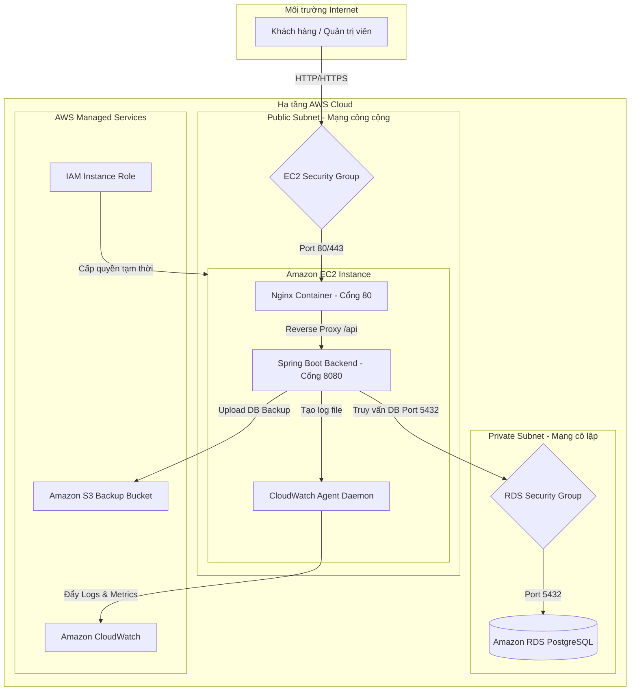

# BÁO CÁO DỰ ÁN VÀ HƯỚNG DẪN THỰC HÀNH (WORKSHOP)
## ĐỀ TÀI: TRIỂN KHAI ỨNG DỤNG SHOPSFLOW TRÊN NỀN TẢNG CLOUD AWS

---

## 4.1. Ý tưởng & Mục tiêu (1.0 điểm)

### 1. Bối cảnh & Bài toán

*   **Hệ thống dùng để làm gì?**
    Hệ thống **Shopsflow** là một ứng dụng thương mại điện tử full-stack hoàn chỉnh bao gồm giao diện Khách hàng (Storefront) để tìm kiếm, mua sắm sản phẩm và thanh toán trực tuyến qua cổng VNPay, kết hợp với giao diện Quản trị viên (Admin Portal) nhằm quản lý danh mục sản phẩm, theo dõi đơn hàng, quản lý kho và xem phân tích doanh thu.
*   **Khách hàng là ai?**
    Khách hàng mục tiêu là các doanh nghiệp vừa và nhỏ (SMBs), các chủ cửa hàng bán lẻ truyền thống đang có nhu cầu chuyển đổi số lên môi trường trực tuyến với chi phí tối ưu, tự chủ hoàn toàn về mã nguồn và cơ sở dữ liệu mà không bị phụ thuộc vào các nền tảng SaaS bên thứ ba.
*   **Giải quyết vấn đề gì?**
    *   **Giảm downtime và rủi ro triển khai:** Khắc phục tình trạng xung đột môi trường (lỗi phiên bản thư viện giữa máy local và máy chủ) bằng công nghệ container hóa (Docker).
    *   **Bảo mật dữ liệu:** Ngăn ngừa việc rò rỉ dữ liệu khách hàng bằng cách đưa cơ sở dữ liệu vào vùng mạng riêng (Private Subnet).
    *   **Bảo toàn dữ liệu:** Tự động hóa quy trình sao lưu (backup) cơ sở dữ liệu PostgreSQL định kỳ, tránh mất mát thông tin khi máy chủ gặp sự cố phần cứng.
    *   **Khả năng giám sát tập trung:** Thay vì phải SSH thủ công vào server để đọc log thô, hệ thống tập trung hóa toàn bộ log ứng dụng và các thông số phần cứng lên Cloud để dễ dàng xử lý sự cố.

### 2. Mục tiêu cụ thể

*   **Output mong muốn:**
    *   **Frontend Web:** Single Page Application (SPA) phát triển bằng React + Vite được tối ưu tải trang và tương thích hoàn toàn với các thiết bị di động.
    *   **Backend API:** RESTful API (Spring Boot) tích hợp cơ chế phân quyền dựa trên Role (RBAC) sử dụng JWT Token, kết hợp tích hợp cổng thanh toán VNPay Sandbox.
    *   **Monitoring System:** Dashboard giám sát hiệu năng CPU/RAM/Network trên Amazon CloudWatch, kèm theo Log Group thu thập log thời gian thực của Docker Container.
    *   **Backup System:** Tự động hóa quá trình dump database và đẩy lên Amazon S3 dạng nén an toàn.
*   **Tiêu chí đánh giá thành công:**
    *   Ứng dụng truy cập được từ Internet công cộng qua địa chỉ IP hoặc tên miền của EC2.
    *   Database RDS PostgreSQL không thể truy cập trực tiếp từ Internet (tắt Public Accessibility), chỉ nhận kết nối nội bộ từ EC2.
    *   Quy trình mua hàng (Checkout) diễn ra nhất quán; hệ thống xử lý tranh chấp tồn kho (concurrency checkout) bằng Optimistic Locking và Database Transactions để không bị âm kho.
    *   Có cảnh báo tự động (Alarm) gửi tới email của quản trị viên khi tài nguyên máy chủ EC2 bị quá tải (CPU > 80%).

### 3. Phù hợp chương trình FCAJ / AWS
*   Dự án sử dụng các dịch vụ nền tảng cơ bản của AWS bao gồm: **EC2**, **RDS**, **CloudWatch**, **S3**, và **IAM**. 
*   Cấu trúc hạ tầng tuân thủ các nguyên tắc thiết kế bảo mật của AWS (Well-Architected Framework), gán quyền thông qua IAM Role thay vì hard-code Access Key, rất phù hợp làm đề tài thực hành thực tế cho học viên trong chương trình First Cloud Journey (FCJ).

---

## 4.2. Kiến trúc & Thiết kế kỹ thuật (2.0 điểm)

### 1. Sơ đồ kiến trúc (Architecture Diagram)

Sơ đồ dưới đây mô tả cấu trúc phân tầng và luồng dữ liệu của ứng dụng Shopsflow khi triển khai trên hạ tầng AWS:



### 2. Lựa chọn dịch vụ (Service Selection Rationale)

*   **Amazon EC2 (Elastic Compute Cloud):**
    *   *Lý do chọn:* EC2 mang lại sự linh hoạt tối đa, cho phép cài đặt Docker và Docker Compose để chạy cả Nginx Frontend lẫn Spring Boot Backend trên cùng một máy chủ ảo siêu tiết kiệm chi phí (`t3.micro` / `t2.micro` thuộc Free Tier). Đây là lựa chọn tối ưu cho môi trường lab/workshop thay vì dùng ECS/Fargate vốn đòi hỏi cấu hình Load Balancer phức tạp và phát sinh nhiều chi phí duy trì.
*   **Amazon RDS for PostgreSQL:**
    *   *Lý do chọn:* RDS là dịch vụ Managed Database giúp tự động hóa các tác vụ quản trị như cài đặt hệ điều hành, vá lỗi bảo mật, và cấu hình sao lưu định kỳ. Việc chọn RDS PostgreSQL giúp đảm bảo tính nhất quán của dữ liệu giao dịch thương mại điện tử tốt hơn nhiều so với việc tự cấu hình cơ sở dữ liệu chạy bên trong EC2 (tránh mất mát dữ liệu khi container database bị hỏng hoặc EC2 bị restart).
*   **Amazon CloudWatch:**
    *   *Lý do chọn:* Dịch vụ giám sát mặc định và tích hợp sâu của AWS. Nó cho phép thu thập log tập trung từ các Docker container thông qua CloudWatch Agent và thiết lập các cảnh báo tự động (Alarms) một cách nhanh chóng mà không cần cài đặt thêm các công cụ bên thứ ba như ELK stack vốn rất nặng và tốn tài nguyên RAM.
*   **Amazon S3 (Simple Storage Service):**
    *   *Lý do chọn:* Lưu trữ đối tượng với độ bền vững cực cao (99.999999999%), chi phí lưu trữ cực rẻ. Phù hợp tuyệt đối để lưu trữ các file nén backup cơ sở dữ liệu (`.sql.gz`) được đẩy lên từ EC2 hàng ngày.

### 3. Bảo mật & IAM cơ bản (Security & Access Control)

*   **Nguyên tắc quyền tối thiểu (Least Privilege):** 
    Tạo một **IAM Role** (ví dụ: `EC2-Shopsflow-Application-Role`) và gán trực tiếp cho EC2 instance. Role này chỉ chứa các policy tối thiểu cần thiết:
    *   `CloudWatchAgentServerPolicy`: Cho phép EC2 gửi log và metric lên CloudWatch.
    *   `AmazonS3FullAccess` (hoặc giới hạn chỉ cho phép đọc/ghi vào đúng 1 bucket S3 được định nghĩa sẵn): Cho phép upload tệp sao lưu dữ liệu.
*   **Hạn chế Public Resource:**
    *   RDS PostgreSQL được thiết lập `Publicly Accessible: No`. Database chỉ nằm trong Private Subnet và chỉ mở port `5432` cho duy nhất địa chỉ IP nội bộ của EC2 Instance (thông qua việc tham chiếu EC2 Security Group làm Source in RDS Inbound Rules).
    *   EC2 chỉ mở cổng `80` (HTTP) và `443` (HTTPS) cho mọi người truy cập. Cổng `22` (SSH) được giới hạn chỉ cho phép IP tĩnh của quản trị viên truy cập hoặc tắt hoàn toàn cổng `22` và sử dụng **AWS Systems Manager Session Manager** để kết nối bảo mật.
*   **Không Hard-code Access Keys:**
    *   Ứng dụng hoàn toàn không sử dụng file `.aws/credentials` hay hard-code `AWS_ACCESS_KEY_ID` / `AWS_SECRET_ACCESS_KEY` trong code hoặc file cấu hình `.env`. AWS SDK và AWS CLI trên EC2 sẽ tự động lấy credentials tạm thời từ metadata của IAM Instance Role đã gán cho EC2.

### 4. Khả năng mở rộng & Vận hành (Scalability & Operations)

*   **Khả năng mở rộng (Scaling):**
    *   *Trong tương lai (Production):* Có thể tách Nginx Frontend ra chạy trên Amazon S3 + CloudFront (CDN), đưa Spring Boot Backend lên AWS ECS Fargate chạy phía sau Application Load Balancer (ALB) kết hợp với Auto Scaling Group để tự động scale số lượng container dựa trên lượng tải CPU/Request Count.
*   **Giám sát & Vận hành (Logging / Monitoring):**
    *   Cài đặt CloudWatch Agent chạy dưới dạng daemon trên máy chủ EC2. Cấu hình tệp `amazon-cloudwatch-agent.json` để monitor đường dẫn chứa log file của backend Spring Boot và Nginx.
    *   Thiết lập CloudWatch Alarm theo dõi chỉ số `CPUUtilization` của EC2. Nếu CPU > 80% trong 2 chu kỳ liên tiếp (mỗi chu kỳ 5 phút), hệ thống sẽ gửi thông báo khẩn cấp qua Amazon SNS (Simple Notification Service) tới email quản trị viên để tiến hành kiểm tra hoặc nâng cấp cấu hình máy chủ.

---

## 4.3. Triển khai & Lab step-by-step (2.0 điểm)

### 1. Prerequisite (Điều kiện chuẩn bị)

*   **Tài khoản AWS:** Quyền Admin hoặc quyền PowerUser để tạo EC2, RDS, S3, IAM, CloudWatch.
*   **Region:** Chọn region gần nhất là Singapore (`ap-southeast-1`).
*   **Công cụ cài đặt trên máy cá nhân:**
    *   AWS CLI đã cấu hình quyền truy cập.
    *   Git (để clone/quản lý source code).
    *   Mã nguồn dự án Shopsflow đầy đủ.

---

### 2. Hướng dẫn chi tiết từng bước (Step-by-Step Guide)

#### 🔹 Bước 1: Thiết lập Security Groups (Mạng)
1.  Truy cập **AWS Console** -> **VPC** -> **Security Groups**.
2.  **Tạo EC2 Security Group** (`shopsflow-ec2-sg`):
    *   *Inbound Rules:*
        *   Type: `HTTP` (Port 80), Source: `0.0.0.0/0` (Mọi nơi).
        *   Type: `SSH` (Port 22), Source: `My IP` (Chỉ cho phép IP máy của bạn để bảo mật).
3.  **Tạo RDS Security Group** (`shopsflow-rds-sg`):
    *   *Inbound Rules:*
        *   Type: `PostgreSQL` (Port 5432), Source: Chọn Security Group `shopsflow-ec2-sg` vừa tạo ở trên (Chỉ cho phép EC2 kết nối vào database).

#### 🔹 Bước 2: Tạo Cơ sở dữ liệu Amazon RDS PostgreSQL
1.  Truy cập **AWS Console** -> **RDS** -> **Create Database**.
2.  Chọn **Standard create** -> **PostgreSQL**.
3.  **Templates:** Chọn **Free Tier** để tối ưu chi phí.
4.  **Settings:**
    *   *DB instance identifier:* `shopsflow-db`
    *   *Master username:* `postgres`
    *   *Master password:* Nhập mật khẩu của bạn (ví dụ: `ShopsflowPass123!`).
5.  **Connectivity:**
    *   *VPC:* Chọn VPC mặc định.
    *   *Public access:* Chọn **No** (Chỉ cho phép truy cập nội bộ).
    *   *Existing VPC security groups:* Chọn `shopsflow-rds-sg` (và bỏ tick group default).
6.  **Additional configuration:**
    *   *Initial database name:* Nhập `shopsflow`.
7.  Nhấn **Create Database** và chờ khoảng 5-10 phút cho đến khi status chuyển sang `Available`. Ghi lại **Endpoint** của database (ví dụ: `shopsflow-db.xxxx.ap-southeast-1.rds.amazonaws.com`).

#### 🔹 Bước 3: Tạo IAM Role cho EC2
1.  Truy cập **AWS Console** -> **IAM** -> **Roles** -> **Create Role**.
2.  **Trusted entity type:** Chọn **AWS Service** -> Common use case: **EC2**.
3.  **Permissions policies:** Tìm kiếm và tick chọn các policy:
    *   `CloudWatchAgentServerPolicy`
    *   `AmazonS3FullAccess`
4.  Đặt tên Role: `ShopsflowEC2Role` và chọn **Create Role**.

#### 🔹 Bước 4: Khởi tạo EC2 Instance
1.  Truy cập **AWS Console** -> **EC2** -> **Launch Instance**.
2.  *Name:* `shopsflow-web-server`.
3.  *OS Image:* `Ubuntu Server 24.04 LTS (HVM)`.
4.  *Instance Type:* `t3.micro` hoặc `t2.micro` (Free tier).
5.  *Key pair:* Tạo key pair mới hoặc dùng key pair có sẵn để SSH.
6.  *Network Settings:* Chọn Select existing security group -> `shopsflow-ec2-sg`.
7.  *Advanced Details:* Tại mục **IAM instance profile**, chọn `ShopsflowEC2Role` đã tạo ở Bước 3.
8.  Nhấn **Launch Instance**.

#### 🔹 Bước 5: Cấu hình và Triển khai ứng dụng trên EC2
1.  Sử dụng Terminal SSH vào EC2:
    ```bash
    ssh -i "keypair.pem" ubuntu@<PUBLIC_IP_EC2>
    ```
2.  Cập nhật hệ thống và cài đặt Docker + Git:
    ```bash
    sudo apt-get update -y
    sudo apt-get install -y docker.io git awscli
    sudo systemctl enable --now docker
    # Cấu hình quyền chạy Docker không cần sudo
    sudo usermod -aG docker ubuntu
    newgrp docker
    ```
3.  Cài đặt Docker Compose v2:
    ```bash
    mkdir -p ~/.docker/cli-plugins/
    curl -SL https://github.com/docker/compose/releases/download/v2.29.1/docker-compose-linux-x86_64 -o ~/.docker/cli-plugins/docker-compose
    chmod +x ~/.docker/cli-plugins/docker-compose
    # Kiểm tra phiên bản
    docker compose version
    ```
4.  Clone mã nguồn dự án Shopsflow về máy chủ EC2:
    ```bash
    git clone <LINK_GITHUB_CUA_BAN> shopsflow
    cd shopsflow/deploy/aws
    ```
5.  Cấu hình tệp môi trường `.env.aws`:
    ```bash
    cp .env.aws.example .env.aws
    nano .env.aws
    ```
    *Điền các thông tin thực tế từ database RDS và sinh JWT Secret mới:*
    ```env
    # Database Config
    SPRING_DATASOURCE_URL=jdbc:postgresql://<RDS_ENDPOINT>:5432/shopsflow
    SPRING_DATASOURCE_USERNAME=postgres
    SPRING_DATASOURCE_PASSWORD=ShopsflowPass123!

    # JWT Config (Tạo chuỗi ngẫu nhiên dài bằng openssl rand -base64 48)
    JWT_SECRET=ThayTheBangChuoiSecretCucKyDaiVaMat1234567890!

    # App Config
    APP_SEED_DEMO_DATA=true
    ```
6.  Triển khai hệ thống bằng Docker Compose:
    ```bash
    # Chạy script deploy đã được chuẩn bị sẵn trong repo
    chmod +x deploy.sh
    ./deploy.sh
    ```
7.  Kiểm tra trạng thái các container:
    ```bash
    docker compose --env-file .env.aws -f docker-compose.aws.yml ps
    ```
    *Đầu ra mong muốn:* Các container `shopsflow-frontend` và `shopsflow-backend` đều ở trạng thái `Up` hoặc `healthy`.

---

#### 🔹 Bước 6: Cấu hình CloudWatch Agent để giám sát Log & Metrics
1.  Tải và cài đặt CloudWatch Agent trên máy chủ EC2:
    ```bash
    wget https://amazoncloudwatch-agent.s3.amazonaws.com/ubuntu/amd64/latest/amazon-cloudwatch-agent.deb
    sudo dpkg -i -od amazon-cloudwatch-agent.deb
    ```
2.  Tạo tệp cấu hình Agent `/opt/aws/amazon-cloudwatch-agent/etc/amazon-cloudwatch-agent.json`:
    ```json
    {
      "agent": {
        "metrics_collection_interval": 60,
        "run_as_user": "cwagent"
      },
      "logs": {
        "logs_collected": {
          "files": {
            "collect_list": [
              {
                "file_path": "/var/lib/docker/containers/*/*.log",
                "log_group_name": "/shopsflow/ec2/docker",
                "log_stream_name": "{hostname}-docker",
                "timestamp_format": "%Y-%m-%dT%H:%M:%S.%fZ"
              }
            ]
          }
        }
      },
      "metrics": {
        "metrics_collected": {
          "cpu": {
            "measurement": ["usage_idle", "usage_user", "usage_system"],
            "metrics_collection_interval": 60,
            "totalcpu": true
          },
          "mem": {
            "measurement": ["active", "available_percent", "used_percent"],
            "metrics_collection_interval": 60
          }
        }
      }
    }
    ```
3.  Khởi động và kích hoạt CloudWatch Agent:
    ```bash
    sudo /opt/aws/amazon-cloudwatch-agent/bin/amazon-cloudwatch-agent-ctl -a fetch-config -m ec2 -s -c file:/opt/aws/amazon-cloudwatch-agent/etc/amazon-cloudwatch-agent.json
    ```

---

#### 🔹 Bước 7: Thực hiện sao lưu dữ liệu tự động lên Amazon S3 (Backup)
1.  Tạo một S3 Bucket trên AWS Console: `shopsflow-database-backup-bucket` (Chọn block public access hoàn toàn).
2.  Chạy script backup mẫu có sẵn trong repo (`backup_to_s3.sh`):
    ```bash
    chmod +x backup_to_s3.sh
    # Cấu hình bucket name trong file backup_to_s3.sh
    ./backup_to_s3.sh
    ```
3.  *Checkpoint:* Kiểm tra trên S3 Console thấy xuất hiện file backup có định dạng `.sql.gz` trong bucket.

---

### 3. Kiểm thử & Xác thực (Test & Validation)

#### 🧪 Kịch bản 1: Kiểm thử API & Giao diện End-to-End
*   **Thao tác:** Mở trình duyệt và truy cập vào IP công cộng của EC2: `http://<EC2_PUBLIC_IP>`.
*   **Kết quả mong đợi:** 
    *   Giao diện trang chủ Shopsflow hiển thị danh sách sản phẩm mẫu đã được tự động seed dữ liệu.
    *   Đăng nhập bằng tài khoản Admin (`admin@shopsflow.com` / `Admin123!`), truy cập được vào Admin Dashboard và thực hiện CRUD sản phẩm thành công.

#### 🧪 Kịch bản 2: Kiểm tra Log Streams trên CloudWatch
*   **Thao tác:** Truy cập **AWS CloudWatch** -> **Log groups** -> Chọn `/shopsflow/ec2/docker`.
*   **Kết quả mong đợi:** Xuất hiện log stream tương ứng với container trên EC2. Log hiển thị các dòng Spring Boot startup hoàn chỉnh và các truy vấn SQL JPA.

#### 🧪 Kịch bản 3: Kiểm thử chức năng Concurrent Stock (Trừ kho đồng thời)
*   **Thao tác:** Sử dụng công cụ Apache Benchmark (ab) hoặc gửi đồng thời 2 request mua sản phẩm cuối cùng qua API checkout.
*   **Kết quả mong đợi:** Chỉ có 1 giao dịch thành công. Giao dịch còn lại bị từ chối với lỗi `409 Conflict` hoặc `OptimisticLockingFailureException` trên log, số lượng sản phẩm trong kho không bị âm.

#### 🧪 Kịch bản 4: Giả lập lỗi quá tải để test CloudWatch Alarm
*   **Thao tác:** Chạy lệnh stress-test CPU trên EC2:
    ```bash
    sudo apt-get install -y stress
    stress --cpu 2 --timeout 300s
    ```
*   **Kết quả mong đợi:** Trạng thái của CloudWatch Alarm chuyển từ `OK` -> `ALARM`. Email của bạn nhận được thông báo cảnh báo từ Amazon SNS.

---

### 4. Dọn dẹp tài nguyên (Clean-up)

Để tránh phát sinh chi phí ngoài ý muốn sau khi kết thúc buổi thực hành/lab, hãy thực hiện dọn dẹp hạ tầng theo thứ tự sau:

1.  **Xóa EC2 Instance:**
    *   Truy cập **EC2** -> **Instances** -> Chọn `shopsflow-web-server` -> Chọn **Instance state** -> **Terminate instance**.
2.  **Xóa RDS Instance:**
    *   Truy cập **RDS** -> **Databases** -> Chọn `shopsflow-db` -> Chọn **Actions** -> **Delete**.
    *   *Lưu ý:* Bỏ chọn "Create final snapshot?" và tick chọn "I acknowledge..." để tiến hành xóa ngay lập tức.
3.  **Xóa S3 Bucket:**
    *   Truy cập **S3** -> Chọn bucket `shopsflow-database-backup-bucket` -> Chọn **Empty** (để xóa hết objects bên trong) -> Chọn **Delete** và nhập tên bucket để xóa hoàn toàn.
4.  **Xóa CloudWatch Log Group:**
    *   Truy cập **CloudWatch** -> **Log groups** -> Chọn `/shopsflow/ec2/docker` -> Chọn **Actions** -> **Delete log group**.
5.  **Xóa IAM Role:**
    *   Truy cập **IAM** -> **Roles** -> Chọn `ShopsflowEC2Role` -> Chọn **Delete**.
